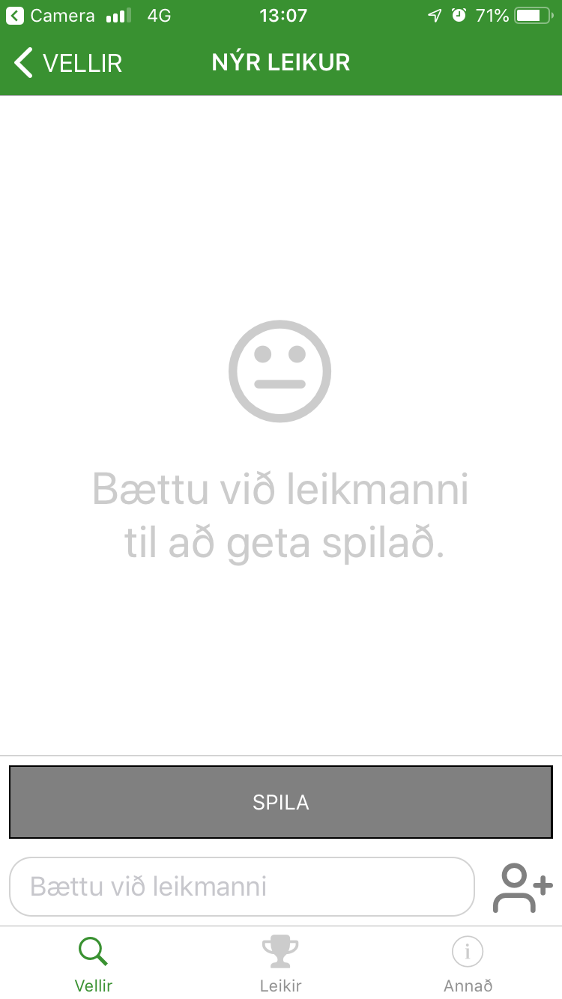
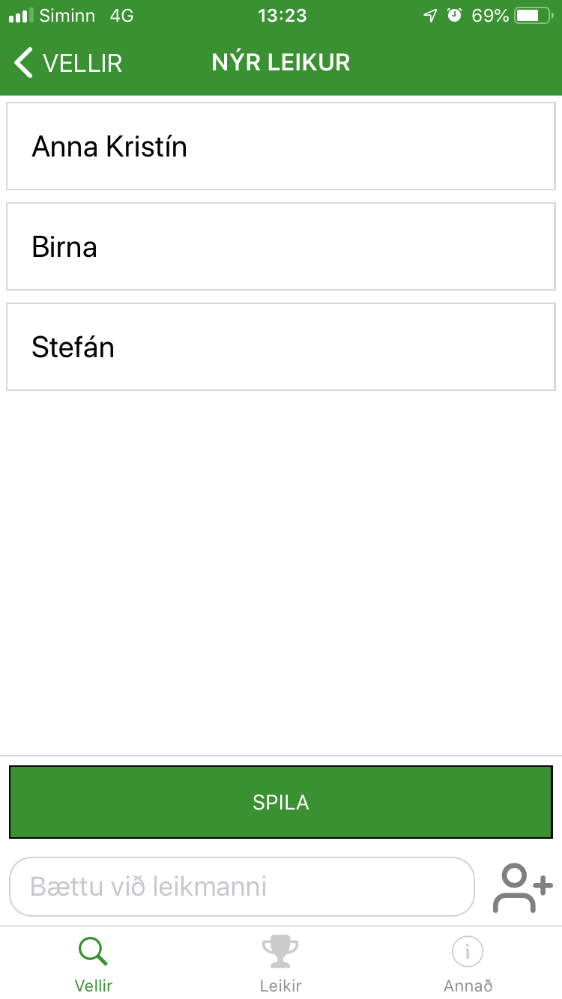
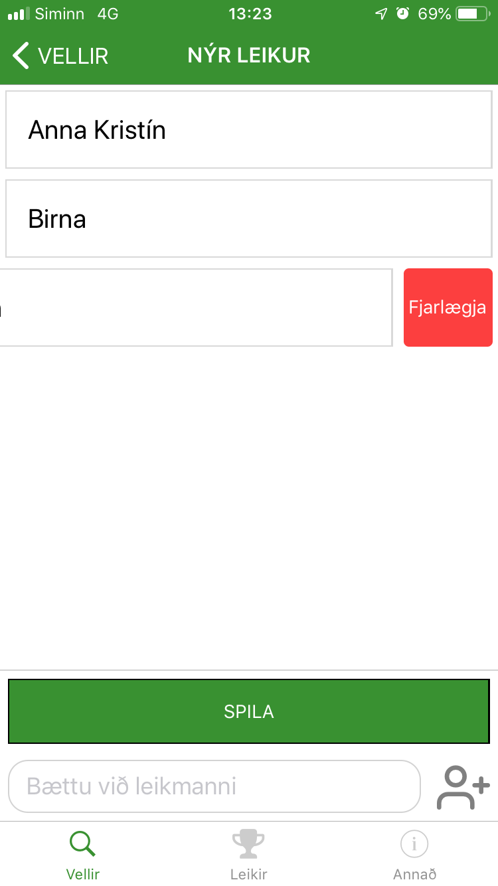
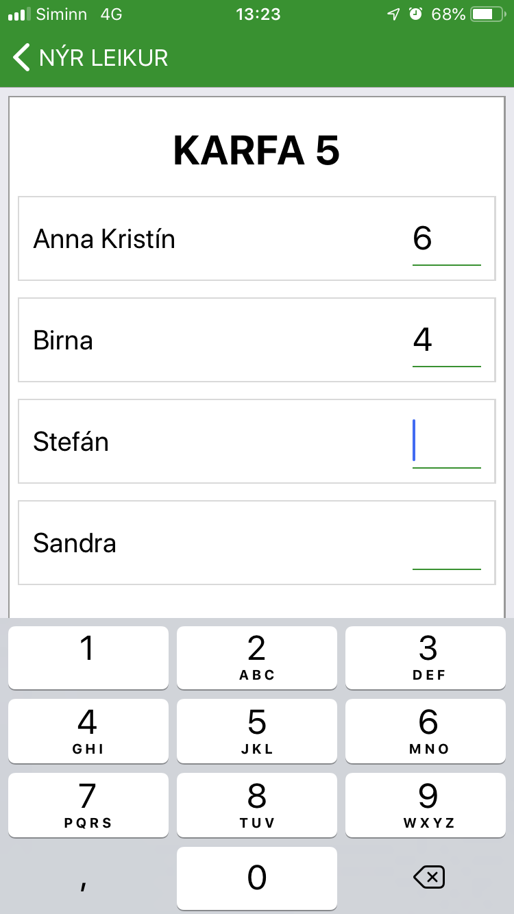
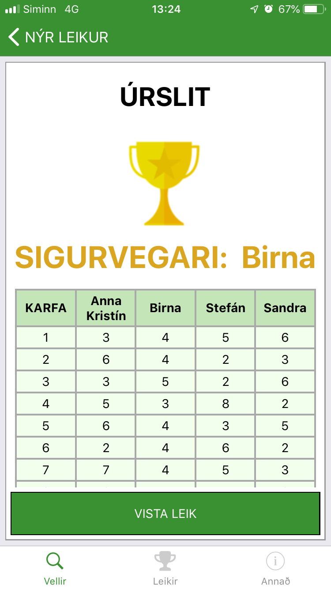
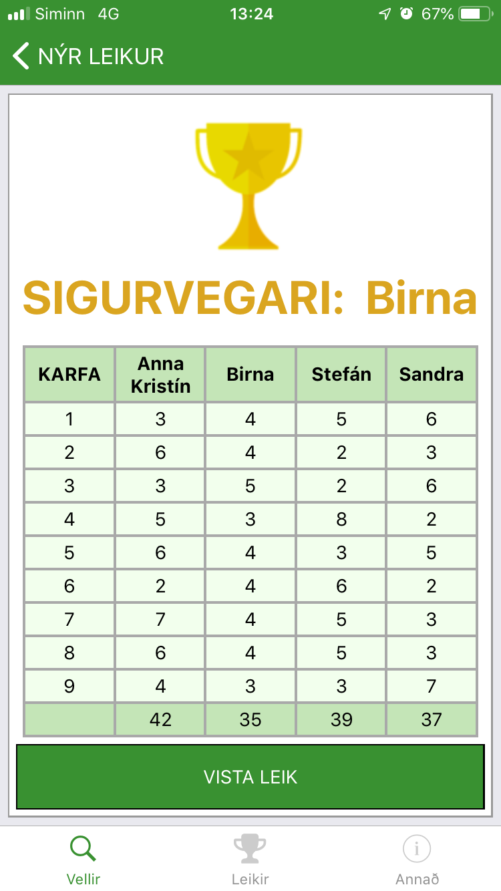
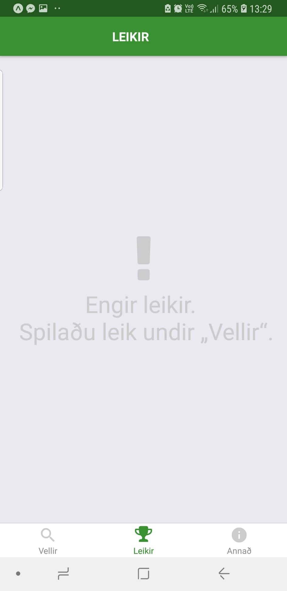
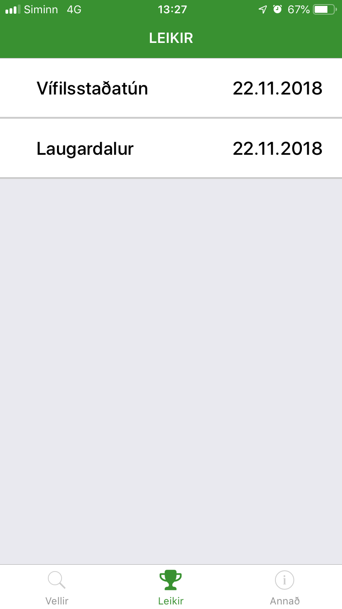
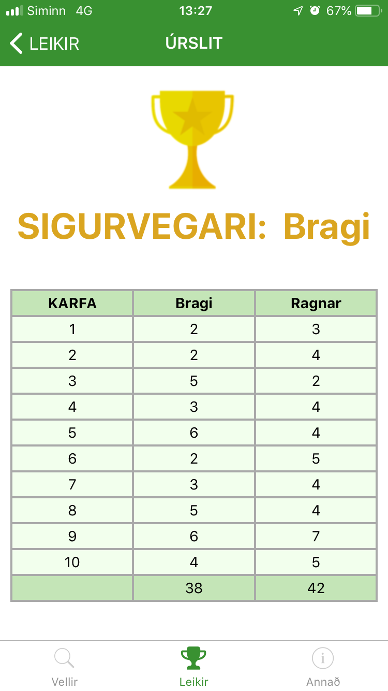
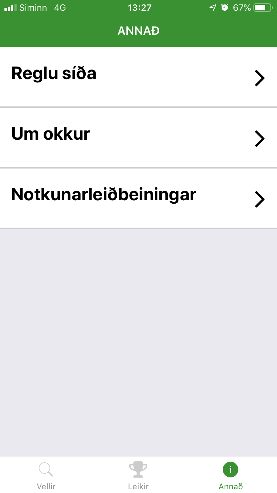

# Frisbee Golf App

Assignment IV - Full blown app.

Fall 2018 - MAPP

- Anna Kristín Halldórsdóttir - annah14@ru.is
- Birna Vala Eyjólfsdóttir - birna14@ru.is
- Sandra Norðfjörð Sigurðardóttir - sandra14@ru.is
- Stefán Hjartarson - stefanhja16@ru.is

## About the app

This app is for tacking scores in while playing frisbee golf with friends. There are a few apps out there that allow you to do this, but we did not find them to have the functionality we would like. We decided to have the app's content in Icelandic to make it accessible to all ages.

## Overview

The app has three navigation tabs at the bottom, each with a few screens. Screenshots are shown below, aswell in the directory screenshots.

### Courses and playing a game

The navigation tap 'Vellir' shows you a list of courses in the web API we made. You can click the course and choose to play it. Before you start playing you need to input the names of the players.

When you start the game you get a view of one basket at the time, but can swipe right to get to the next one. You can always swipe left to go to the previous basket aswell. When on the last basket, you can swipe right to see the results, you can also view this while playing the game. After you have filled in all the scores you can save the game from the results screen.

<div style="display:flex;justify-content:center;">
  <div style="padding:5px;">
    
  </div>
  <div style="padding:5px;">
    
  </div>
  <div style="padding:5px;">
    
  </div>
</div>
<div style="display:flex;justify-content:center;">
  <div style="padding:5px;">
    
  </div>
  <div style="padding:5px;">
    
  </div>
  <div style="padding:5px;">
    
  </div>
</div>

### Viewing saved games

The bottom tab 'Leikir' shows a list of all saved games, so you can view their results. These games are saved to local storage. Other parts of the redux store are not.

<div style="display:flex;justify-content:center">
  <div style="padding:5px;">
    
  </div>
  <div style="padding:5px;">
    
  </div>
  <div style="padding:5px;">
    
  </div>
</div>

### Other

Under the bottom tab 'Annað' other information is stored. There you can read the rules of frisbee golf, about the development of the app, and detailed instructions on using the app.

<div style="display:flex;justify-content:center">
  
</div>

## Course database and API

We looked into getting access to international frisbee golf APIs. We found two, but both had very restrictive requirements of having their logo at all pages that use their API and how the information can be displayed. Their API didn't either have all the courses in Iceland so there wasn't a huge benifit in using it. Therefore we decided to write our own API which we have put a few courses into.

The API was written in Node.js and deployed on heroku. It has one availible GET request

**Link to API**

```
https://frisbi-service.herokuapp.com/
```

**Get all courses request**

- **Method:** GET
- **URL:** /api/courses/

## Next steps

Next steps in development in this app would be:

- Add a map of the courses so you can view the ones closest to you.
- Add all courses in Iceland to the course database.
  - amend the GET request so that it can request courses by area.
- Allow login preferably with facebook login.
- Allow to choose Facebook friends to play with.
- Save games to a server, instead of local storage.
- After playing a game with other facebook friends and saving it, all other players that have an account can se the game after it has been saved aswell.
- Make English availible for the app aswell.

## Shortcomming - KeyboardAvoidingView

We spent a long time trying to get the KeyboardAvoidingView to work on both Android and iOS in the NewGame screen, shown below. We got it to work on iOS but unforatunatly on Android the input does not move enough up when the keyboard is visible.

We adviced the teachers in the course and found out that this could be a major problem. We eventually did not find a way to fix this for Android.

<div style="display:flex;justify-content:center">
  
</div>
